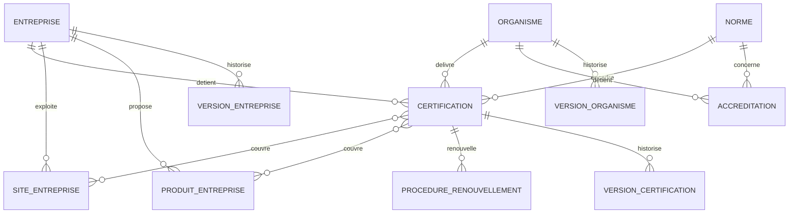
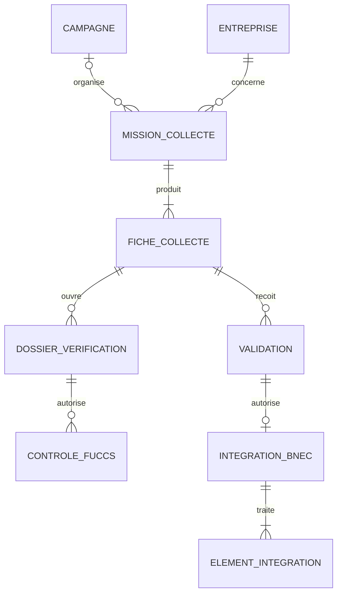
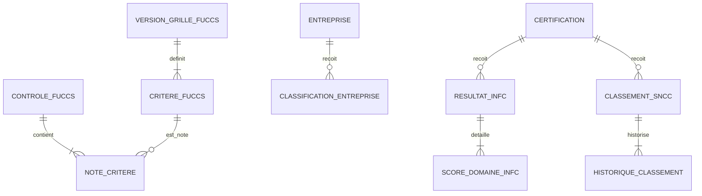

# Modèle conceptuel de données — HAUQE Certif

> Projet : Base nationale des entreprises certifiées (BNEC)  
> Version : 0.1  
> Date : 23 juillet 2026  
> Statut : première version de travail à relire  
> Niveau : modèle conceptuel de données, indépendant de PostgreSQL

**Schéma FigJam exportable en PDF :**  
https://www.figma.com/board/0j0nzNoxxG49v3QJxXWBgF

**Livrable PDF contracté et détaillé :**  
`output/pdf/MCD_HAUQE_CERTIF_POWERDESIGNER.pdf`

## 1. Objet

Ce document décrit les objets métier, leurs propriétés essentielles, leurs associations, leurs cardinalités et les principales règles de gestion du système HAUQE Certif.

Le MCD couvre le parcours :

**Brouillon → Soumise → Vérification → Contrôle FUCCS → Validation définitive → Intégration BNEC → Classification entreprise / INFC → SNCC → Veille**

Il sépare explicitement :

- les données déclarées pendant la collecte ;
- les données officielles intégrées dans la BNEC ;
- le contrôle FUCCS sur 56 ;
- la classification globale de l'entreprise ;
- l'INFC d'une certification sur 100 ;
- le classement SNCC ;
- les versions, preuves et événements d'audit.

## 2. Périmètre et méthode

### 2.1 Sources

Le modèle est fondé sur :

- les règles métier RM-01 à RM-51 validées ;
- les procédures et formulaires opérationnels ;
- la fiche FUCCS ;
- les documents INFC et SNCC ;
- les trois documents de continuité du projet ;
- les écrans existants et les nouvelles maquettes fonctionnelles.

### 2.2 Conventions conceptuelles

- `#` désigne l'identifiant conceptuel d'une entité ;
- les cardinalités sont notées `(minimum, maximum)` ;
- une propriété entre crochets est conditionnelle ;
- les propriétés techniques PostgreSQL ne figurent pas encore dans le MCD ;
- les valeurs répétables sont modélisées par des entités ou associations ;
- une donnée historique importante ne remplace jamais silencieusement sa version antérieure.

## 3. Domaines fonctionnels

| Code | Domaine | Finalité |
|---|---|---|
| D01 | Identités et habilitations | Utilisateurs, rôles, permissions, sessions et sécurité |
| D02 | Référentiels | Géographie, normes, produits, activités et nomenclatures |
| D03 | Entreprises | Identité, sites, contacts, produits, marchés et versions |
| D04 | Organismes | Organismes certificateurs, accréditeurs et accréditations |
| D05 | Certifications | Certificats, portées, sites, produits, audits et renouvellements |
| D06 | Documents | Preuves, versions, contrôles et archivage documentaire |
| D07 | Collecte | Campagnes, missions, fiches déclarées et révisions |
| D08 | Vérification | Contrôles documentaires, anomalies et demandes de confirmation |
| D09 | Contrôle et validation | FUCCS, décisions, réserves et corrections |
| D10 | Intégration BNEC | Précontrôle, codification, intégration et contrôle postérieur |
| D11 | Évaluation | Classification entreprise, INFC et SNCC |
| D12 | Veille | Échéances, alertes, notifications, relances et actions |
| D13 | Gouvernance | Règles, qualité, décisions, publications et rapports |
| D14 | Audit et continuité | Audit, archives, sauvegardes, restaurations et incidents |

## 4. Entités conceptuelles

### D01 — Identités et habilitations

#### UTILISATEUR

`#utilisateur`, adresse professionnelle, prénom, nom, téléphone, fonction, statut, région d'affectation, MFA activé, dernière connexion.

#### RÔLE

`#rôle`, code, libellé, description, état d'activation.

#### PERMISSION

`#permission`, code, libellé, domaine fonctionnel, action autorisée, description.

#### ATTRIBUTION_RÔLE

`#attribution`, date de début, date de fin éventuelle, auteur de l'attribution, état.

#### SESSION_UTILISATEUR

`#session`, début, dernière activité, expiration, verrouillage de reprise, révocation, contexte de connexion.

#### ÉVÉNEMENT_SÉCURITÉ

`#événement`, type, date, résultat, gravité, contexte, adresse réseau éventuelle.

Associations :

- un UTILISATEUR reçoit `(0,N)` ATTRIBUTION_RÔLE ;
- une ATTRIBUTION_RÔLE concerne exactement `(1,1)` RÔLE ;
- un RÔLE autorise `(0,N)` PERMISSION et une PERMISSION appartient à `(0,N)` RÔLE ;
- un UTILISATEUR ouvre `(0,N)` SESSION_UTILISATEUR ;
- un UTILISATEUR est concerné par `(0,N)` ÉVÉNEMENT_SÉCURITÉ.

### D02 — Référentiels

#### RÉGION

`#région`, code, libellé, état.

#### PRÉFECTURE

`#préfecture`, code, libellé, état.

#### COMMUNE

`#commune`, code, libellé, état.

#### LOCALITÉ

`#localité`, code éventuel, libellé, état.

#### CATÉGORIE_RÉFÉRENTIEL

`#catégorie`, code, libellé, description.

#### VALEUR_RÉFÉRENTIEL

`#valeur`, code, libellé, description, ordre, période de validité, état.

#### NORME

`#norme`, code, nom, version, autorité émettrice, période d'application, expiration obligatoire ou non, état.

Associations :

- une RÉGION contient `(1,N)` PRÉFECTURE ;
- une PRÉFECTURE appartient à `(1,1)` RÉGION ;
- une PRÉFECTURE contient `(1,N)` COMMUNE ;
- une COMMUNE appartient à `(1,1)` PRÉFECTURE ;
- une COMMUNE contient `(0,N)` LOCALITÉ ;
- une LOCALITÉ appartient à `(1,1)` COMMUNE ;
- une CATÉGORIE_RÉFÉRENTIEL contient `(0,N)` VALEUR_RÉFÉRENTIEL ;
- une VALEUR_RÉFÉRENTIEL appartient à `(1,1)` CATÉGORIE_RÉFÉRENTIEL ;
- une VALEUR_RÉFÉRENTIEL peut être subordonnée à `(0,1)` autre VALEUR_RÉFÉRENTIEL.

### D03 — Entreprises

#### ENTREPRISE

`#entreprise`, identifiant national permanent, raison sociale, nom commercial, RCCM éventuel, NIF/IFU éventuel, forme juridique, date de création, adresse, téléphone, courriel, site web, effectif, statut administratif, niveau de risque, état d'archivage.

#### VERSION_ENTREPRISE

`#version`, numéro, date d'effet, motif, valeurs figées, auteur, état.

#### CONTACT_ENTREPRISE

`#contact`, nom complet, fonction, téléphone, courriel, contact principal.

#### SITE_ENTREPRISE

`#site`, nom, type, adresse, coordonnées géographiques, état.

#### ACTIVITÉ_ENTREPRISE

`#activité_entreprise`, caractère principal, date de début, état.

#### PRODUIT_ENTREPRISE

`#produit_entreprise`, désignation déclarée, volume annuel, unité, capacité de production, état.

#### MARCHÉ_ENTREPRISE

`#marché_entreprise`, type de marché, détail, destination éventuelle.

#### CANDIDAT_DOUBLON

`#candidat`, type de ressource, critères concordants, score de similarité, état d'examen, décision, motif.

Associations :

- une ENTREPRISE possède `(0,N)` VERSION_ENTREPRISE ;
- une ENTREPRISE dispose de `(1,N)` CONTACT_ENTREPRISE, dont au plus un principal par type ;
- une ENTREPRISE exploite `(0,N)` SITE_ENTREPRISE ;
- une ENTREPRISE exerce `(1,N)` ACTIVITÉ_ENTREPRISE ;
- une ENTREPRISE propose `(0,N)` PRODUIT_ENTREPRISE ;
- une ENTREPRISE dessert `(0,N)` MARCHÉ_ENTREPRISE ;
- une ENTREPRISE est localisée dans `(1,1)` RÉGION et `(1,1)` LOCALITÉ ;
- un CANDIDAT_DOUBLON rapproche exactement deux ressources comparables.

### D04 — Organismes et accréditations

#### ORGANISME

`#organisme`, identifiant national, nom officiel, sigle, type, pays, numéro d'enregistrement, représentation au Togo, adresse, contacts officiels, statut de reconnaissance, dernière vérification.

#### VERSION_ORGANISME

`#version`, numéro, date d'effet, motif, valeurs figées, auteur.

#### ACCRÉDITATION

`#accréditation`, numéro, accréditeur, domaine technique, périmètre, délivrance, expiration, statut, référence de vérification.

#### HISTORIQUE_ACCRÉDITATION

`#événement`, ancien statut, nouveau statut, date, motif, source, décision HAUQE éventuelle.

Associations :

- un ORGANISME possède `(0,N)` VERSION_ORGANISME ;
- un ORGANISME détient `(0,N)` ACCRÉDITATION ;
- une ACCRÉDITATION concerne `(1,1)` NORME ;
- une ACCRÉDITATION possède `(1,N)` HISTORIQUE_ACCRÉDITATION ;
- une ACCRÉDITATION peut exister sans être active ;
- un ORGANISME non accrédité peut néanmoins être enregistré.

### D05 — Certifications

#### CERTIFICATION

`#certification`, identifiant national, numéro original, portée, date d'obtention, date d'effet, date d'expiration éventuelle, statut, état de vérification, authenticité, caractère stratégique, dernière vérification.

#### VERSION_CERTIFICATION

`#version`, numéro, date d'effet, motif, valeurs figées, auteur.

#### COUVERTURE_PRODUIT

`#couverture_produit`, détail de couverture.

#### COUVERTURE_SITE

`#couverture_site`, détail de couverture.

#### AUDIT_CERTIFICATION

`#audit`, type, date prévue, date réalisée, résultat, prochain audit, observations.

#### ÉVÉNEMENT_CERTIFICATION

`#événement`, type, ancien statut, nouveau statut, date, motif, source.

#### PROCÉDURE_RENOUVELLEMENT

`#procédure`, date d'ouverture, état, date attendue, date de décision, résultat, justification.

#### PREUVE_RENOUVELLEMENT

`#preuve`, type, référence, date, statut de vérification.

Associations :

- une ENTREPRISE détient `(0,N)` CERTIFICATION ;
- une CERTIFICATION appartient à `(1,1)` ENTREPRISE ;
- un ORGANISME délivre `(0,N)` CERTIFICATION ;
- une CERTIFICATION est délivrée par `(1,1)` ORGANISME ;
- une CERTIFICATION applique `(1,1)` NORME ;
- une CERTIFICATION possède `(1,N)` VERSION_CERTIFICATION ;
- une CERTIFICATION couvre `(0,N)` PRODUIT_ENTREPRISE via COUVERTURE_PRODUIT ;
- une CERTIFICATION couvre `(0,N)` SITE_ENTREPRISE via COUVERTURE_SITE ;
- une CERTIFICATION connaît `(0,N)` AUDIT_CERTIFICATION ;
- une CERTIFICATION connaît `(1,N)` ÉVÉNEMENT_CERTIFICATION ;
- une CERTIFICATION peut engager `(0,N)` PROCÉDURE_RENOUVELLEMENT ;
- une PROCÉDURE_RENOUVELLEMENT comporte `(1,N)` PREUVE_RENOUVELLEMENT.

### D06 — Documents

#### DOCUMENT

`#document`, nom original, type documentaire, source, auteur déclaré, date du document, statut, niveau de confidentialité, empreinte d'intégrité, état d'archivage.

#### VERSION_DOCUMENT

`#version`, numéro, fichier logique, format, taille, date de dépôt, auteur du dépôt, état de vérification.

#### LIEN_DOCUMENTAIRE

`#lien`, rôle du document, date d'association, état.

Associations :

- un DOCUMENT possède `(1,N)` VERSION_DOCUMENT ;
- une VERSION_DOCUMENT peut remplacer `(0,1)` VERSION_DOCUMENT précédente ;
- un DOCUMENT est relié à `(1,N)` ressource métier via LIEN_DOCUMENTAIRE ;
- une ressource métier peut être justifiée par `(0,N)` DOCUMENT.

Au MLD, les ressources critiques recevront des associations documentaires explicites.

### D07 — Campagnes, missions et collecte

#### CAMPAGNE

`#campagne`, code, nom, objet, période, objectif quantitatif, statut.

#### MISSION_COLLECTE

`#mission`, code, objet, date prévue, début, fin, priorité, statut, progression.

#### AFFECTATION_AGENT

`#affectation`, début, fin, auteur, motif, statut.

#### FICHE_COLLECTE

`#fiche`, version de formulaire, numéro de révision, état courant, complétude, consentement, déclarant, fonction du déclarant, signature, observations, sauvegarde, soumission.

#### PRODUIT_DÉCLARÉ

`#produit_déclaré`, nom, volume, unité, capacité, marchés visés.

#### CERTIFICATION_DÉCLARÉE

`#certification_déclarée`, norme déclarée, numéro déclaré, organisme déclaré, portée, dates déclarées, statut déclaré, disponibilité de copie.

#### HISTORIQUE_COLLECTE

`#événement`, ancien statut, nouveau statut, date, acteur, commentaire.

Associations :

- une CAMPAGNE organise `(0,N)` MISSION_COLLECTE ;
- une MISSION_COLLECTE relève de `(0,1)` CAMPAGNE ;
- une MISSION_COLLECTE concerne `(1,1)` ENTREPRISE existante ou candidate ;
- une MISSION_COLLECTE reçoit `(1,N)` AFFECTATION_AGENT dans le temps ;
- une AFFECTATION_AGENT concerne `(1,1)` UTILISATEUR ;
- une MISSION_COLLECTE produit `(1,N)` FICHE_COLLECTE ;
- une seule FICHE_COLLECTE est courante pour une mission ;
- une FICHE_COLLECTE déclare `(0,N)` PRODUIT_DÉCLARÉ ;
- une FICHE_COLLECTE déclare `(0,N)` CERTIFICATION_DÉCLARÉE ;
- une MISSION_COLLECTE possède `(1,N)` HISTORIQUE_COLLECTE ;
- une CERTIFICATION_DÉCLARÉE peut être rapprochée de `(0,1)` CERTIFICATION officielle.

### D08 — Vérification documentaire

#### DOSSIER_VÉRIFICATION

`#dossier`, début, fin, statut, avis, synthèse.

#### AFFECTATION_VÉRIFICATION

`#affectation`, début, fin, échéance, motif, état.

#### POINT_VÉRIFICATION

`#point`, code, libellé figé, résultat, observation, date.

#### ANOMALIE_VÉRIFICATION

`#anomalie`, catégorie, gravité, description, statut, résolution.

#### DEMANDE_CONFIRMATION

`#demande`, canal, destinataire, objet, envoi, réponse attendue, statut.

#### RÉPONSE_CONFIRMATION

`#réponse`, date, contenu synthétique, résultat d'exploitation.

Associations :

- une FICHE_COLLECTE soumise ouvre `(0,N)` DOSSIER_VÉRIFICATION ;
- un DOSSIER_VÉRIFICATION reçoit `(1,N)` AFFECTATION_VÉRIFICATION ;
- une AFFECTATION_VÉRIFICATION désigne `(1,1)` UTILISATEUR vérificateur ;
- un DOSSIER_VÉRIFICATION comporte `(1,N)` POINT_VÉRIFICATION ;
- un DOSSIER_VÉRIFICATION révèle `(0,N)` ANOMALIE_VÉRIFICATION ;
- un DOSSIER_VÉRIFICATION génère `(0,N)` DEMANDE_CONFIRMATION ;
- une DEMANDE_CONFIRMATION s'adresse à `(0,1)` ORGANISME ou `(0,1)` ENTREPRISE ;
- une DEMANDE_CONFIRMATION reçoit `(0,N)` RÉPONSE_CONFIRMATION.

### D09 — Contrôle FUCCS et validation

#### VERSION_GRILLE_FUCCS

`#version_grille`, libellé, période d'effet, état de publication, référence d'approbation.

#### RUBRIQUE_FUCCS

`#rubrique`, code, libellé, ordre.

#### CRITÈRE_FUCCS

`#critère`, code, libellé, description, score maximal, ordre, obligation de commentaire.

#### CONTRÔLE_FUCCS

`#contrôle`, code, début, fin, statut, score brut, score maximal, taux, synthèse.

#### NOTE_CRITÈRE

`#note`, score, commentaire, date de notation.

#### CONSTAT

`#constat`, type, gravité, titre, description, statut.

#### VALIDATION

`#validation`, niveau, décision, date, réserves, justification, statut.

#### DEMANDE_CORRECTION

`#correction`, motif, instruction, demande, échéance, resoumission, statut.

Associations :

- une VERSION_GRILLE_FUCCS contient exactement `(4,4)` RUBRIQUE_FUCCS dans la version officielle actuelle ;
- une VERSION_GRILLE_FUCCS contient exactement `(28,28)` CRITÈRE_FUCCS dans la version officielle actuelle ;
- une RUBRIQUE_FUCCS regroupe `(1,N)` CRITÈRE_FUCCS ;
- un DOSSIER_VÉRIFICATION admissible peut déclencher `(0,N)` CONTRÔLE_FUCCS ;
- un CONTRÔLE_FUCCS utilise `(1,1)` VERSION_GRILLE_FUCCS ;
- un CONTRÔLE_FUCCS possède `(1,N)` NOTE_CRITÈRE ;
- une NOTE_CRITÈRE concerne `(1,1)` CRITÈRE_FUCCS ;
- un CONTRÔLE_FUCCS produit `(0,N)` CONSTAT ;
- une FICHE_COLLECTE reçoit `(0,N)` VALIDATION ;
- une VALIDATION est prononcée par `(1,1)` UTILISATEUR ;
- une VALIDATION peut émettre `(0,N)` DEMANDE_CORRECTION ;
- la validation définitive exige les niveaux et visas prévus par la règle active.

### D10 — Intégration BNEC

#### INTÉGRATION_BNEC

`#intégration`, début, fin, statut, résultat du précontrôle, résultat du post-contrôle, référence de sauvegarde.

#### ÉLÉMENT_INTÉGRATION

`#élément`, type d'objet, action, code généré, statut, erreur éventuelle.

Associations :

- une validation formelle autorise `(0,1)` INTÉGRATION_BNEC active ;
- une INTÉGRATION_BNEC est réalisée par `(1,1)` UTILISATEUR habilité ;
- une INTÉGRATION_BNEC traite `(1,N)` ÉLÉMENT_INTÉGRATION ;
- un ÉLÉMENT_INTÉGRATION prend sa source dans `(1,1)` révision déclarée ;
- un ÉLÉMENT_INTÉGRATION produit ou met à jour `(0,1)` ressource officielle.

### D11 — Classification entreprise, INFC et SNCC

#### MODÈLE_SCORING

`#modèle`, code, objet évalué, description.

#### VERSION_MODÈLE_SCORING

`#version`, libellé, période d'effet, état, référence d'approbation, règle de calcul figée.

#### PONDÉRATION

`#pondération`, domaine, valeur, période d'application.

#### CLASSIFICATION_ENTREPRISE

`#classification`, score, classe, date de calcul, état de validation, données sources figées.

#### RÉSULTAT_INFC

`#résultat`, score sur 100, niveau, date de calcul, état de validation, données sources figées.

#### SCORE_DOMAINE_INFC

`#score_domaine`, domaine, valeur brute, valeur pondérée, complétude, preuve synthétique.

#### CLASSEMENT_SNCC

`#classement`, classe A+ à D, statut administratif, risque R1 à R5, justification, date d'effet, état.

#### HISTORIQUE_CLASSEMENT

`#événement`, anciennes valeurs, nouvelles valeurs, date, motif.

Associations :

- un MODÈLE_SCORING possède `(1,N)` VERSION_MODÈLE_SCORING ;
- une VERSION_MODÈLE_SCORING définit `(1,N)` PONDÉRATION ;
- une ENTREPRISE reçoit `(0,N)` CLASSIFICATION_ENTREPRISE ;
- une CLASSIFICATION_ENTREPRISE utilise `(1,1)` VERSION_MODÈLE_SCORING ;
- une CERTIFICATION reçoit `(0,N)` RÉSULTAT_INFC ;
- un RÉSULTAT_INFC utilise `(1,1)` VERSION_MODÈLE_SCORING ;
- un RÉSULTAT_INFC contient exactement `(6,6)` SCORE_DOMAINE_INFC dans le modèle actuel ;
- une CERTIFICATION reçoit `(0,N)` CLASSEMENT_SNCC ;
- un CLASSEMENT_SNCC peut s'appuyer sur `(0,1)` RÉSULTAT_INFC ;
- un CLASSEMENT_SNCC possède `(1,N)` HISTORIQUE_CLASSEMENT ;
- le FUCCS, la classification entreprise, l'INFC et le SNCC ne partagent pas un même résultat.

### D12 — Échéances, alertes et veille

#### ÉCHÉANCE

`#échéance`, code, type, titre, description, date, priorité, statut, achèvement.

#### ALERTE

`#alerte`, code, type, niveau, titre, message, détection, prise en compte, résolution, statut.

#### AFFECTATION_ALERTE

`#affectation`, date, échéance de traitement, instruction, auteur, état.

#### HISTORIQUE_ALERTE

`#événement`, action, anciennes valeurs, nouvelles valeurs, commentaire, date.

#### RÈGLE_NOTIFICATION

`#règle`, type d'alerte, activation, premier délai, répétition, expéditeur, réponse.

#### DESTINATAIRE_NOTIFICATION

`#destinataire`, type, adresse externe éventuelle, état.

#### LIVRAISON_NOTIFICATION

`#livraison`, canal, destinataire, objet, mise en file, envoi, résultat, erreur, nombre de tentatives.

#### DOSSIER_VEILLE

`#dossier`, événement, priorité, ouverture, prochaine action, statut, clôture.

#### RELANCE

`#relance`, destinataire, canal, objet, envoi, échéance, réponse, résultat.

#### RAPPORT_VEILLE

`#rapport`, type, période, statut, préparation, validation.

Associations :

- une ressource métier génère `(0,N)` ÉCHÉANCE ;
- une ÉCHÉANCE peut déclencher `(0,N)` ALERTE ;
- une ALERTE reçoit `(0,N)` AFFECTATION_ALERTE dans le temps ;
- une AFFECTATION_ALERTE désigne `(1,1)` UTILISATEUR ;
- une ALERTE possède `(1,N)` HISTORIQUE_ALERTE ;
- une RÈGLE_NOTIFICATION désigne `(1,N)` DESTINATAIRE_NOTIFICATION ;
- une ALERTE produit `(0,N)` LIVRAISON_NOTIFICATION ;
- une CERTIFICATION ouvre `(0,N)` DOSSIER_VEILLE ;
- un DOSSIER_VEILLE reçoit `(0,N)` RELANCE ;
- la CVC produit `(0,N)` RAPPORT_VEILLE.

### D13 — Gouvernance, qualité, décisions et publications

#### VERSION_RÈGLE_MÉTIER

`#version`, libellé, période d'effet, état, référence d'approbation.

#### RÈGLE_MÉTIER

`#règle`, code RM, famille, libellé, description.

#### PARAMÈTRE_RÈGLE

`#paramètre`, clé, valeur, type, date d'effet.

#### REVUE_QUALITÉ

`#revue`, période, périmètre, début, fin, statut, résultat global.

#### CONSTAT_QUALITÉ

`#constat`, dimension, gravité, description, statut.

#### PLAN_ACTION

`#plan`, titre, objectif, responsable, échéance, priorité, indicateur, cible, progression, statut.

#### NOTE_DÉCISION

`#note`, période, contexte, constats, risques, options, recommandation, statut.

#### DÉCISION_INSTITUTIONNELLE

`#décision`, code, titre, texte, autorité, date, priorité, statut.

#### DEMANDE_PUBLICATION

`#publication`, objet, périmètre, niveau de confidentialité, statut, date de soumission.

#### APPROBATION_PUBLICATION

`#approbation`, décision, date, réserve, autorité.

#### MODÈLE_RAPPORT

`#modèle`, code, nom, catégorie, formats autorisés, état.

#### DEMANDE_RAPPORT

`#demande`, filtres, sections, format, état, début, fin, résultat.

Associations :

- une VERSION_RÈGLE_MÉTIER contient `(1,N)` RÈGLE_MÉTIER ;
- une RÈGLE_MÉTIER définit `(0,N)` PARAMÈTRE_RÈGLE ;
- une REVUE_QUALITÉ produit `(0,N)` CONSTAT_QUALITÉ ;
- un CONSTAT_QUALITÉ déclenche `(0,N)` PLAN_ACTION ;
- une NOTE_DÉCISION conduit à `(0,N)` DÉCISION_INSTITUTIONNELLE ;
- une DÉCISION_INSTITUTIONNELLE ordonne `(0,N)` PLAN_ACTION ;
- une DEMANDE_PUBLICATION reçoit `(0,N)` APPROBATION_PUBLICATION ;
- un MODÈLE_RAPPORT génère `(0,N)` DEMANDE_RAPPORT ;
- une DEMANDE_RAPPORT est initiée par `(1,1)` UTILISATEUR.

### D14 — Audit, archivage et continuité

#### ÉVÉNEMENT_AUDIT

`#événement`, date, acteur éventuel, action, catégorie, ressource, résultat, contexte, valeurs avant, valeurs après, empreinte d'intégrité.

#### ARCHIVE

`#archive`, ressource, date, motif, auteur, durée de conservation, état.

#### POLITIQUE_CONSERVATION

`#politique`, catégorie de données, durée, base réglementaire, date d'effet, état.

#### POLITIQUE_SAUVEGARDE

`#politique`, fréquence, rétention, périmètre, état.

#### EXÉCUTION_SAUVEGARDE

`#exécution`, début, fin, taille, emplacement logique, résultat, intégrité.

#### TEST_RESTAURATION

`#test`, date, périmètre, sauvegarde testée, résultat, durée, preuve.

#### INCIDENT

`#incident`, code, catégorie, gravité, déclaration, description, statut, résolution, clôture.

Associations :

- un UTILISATEUR produit `(0,N)` ÉVÉNEMENT_AUDIT ;
- toute ressource sensible connaît `(0,N)` ÉVÉNEMENT_AUDIT ;
- une ressource métier peut faire l'objet de `(0,1)` ARCHIVE active ;
- une ARCHIVE applique `(1,1)` POLITIQUE_CONSERVATION ;
- une POLITIQUE_SAUVEGARDE génère `(0,N)` EXÉCUTION_SAUVEGARDE ;
- une EXÉCUTION_SAUVEGARDE est évaluée par `(0,N)` TEST_RESTAURATION ;
- un INCIDENT peut être lié à `(0,N)` ÉVÉNEMENT_SÉCURITÉ ou exécution technique.

## 5. Vue conceptuelle synthétique

La version FigJam destinée au livrable représente sur un canevas unique les 20 entités centrales, leurs attributs principaux et les cardinalités structurantes. Le présent document conserve le modèle conceptuel détaillé par domaine.

Le PDF multipage constitue la version de diffusion : une page de présentation et de légende suivie de dix planches détaillées au format A3 paysage. La représentation suit une notation Merise proche de PowerDesigner : entités, identifiants conceptuels, attributs métier, associations nommées et cardinalités portées par les liaisons.

## 6. Règles de gestion transversales

| Code MCD | Règle conceptuelle |
|---|---|
| RG-001 | Tout identifiant national attribué est permanent et non réattribuable. |
| RG-002 | Les suppressions physiques des données métier sont interdites. |
| RG-003 | Une entreprise peut être enregistrée sans RCCM sous statut de régularisation. |
| RG-004 | Une certification appartient à une seule entreprise, un seul organisme et une seule norme pour une version donnée. |
| RG-005 | La combinaison entreprise–organisme–norme–périmètre doit être contrôlée comme doublon potentiel. |
| RG-006 | Une date d'obtention est obligatoire et ne peut être future. |
| RG-007 | Une date d'expiration est omise seulement si la norme l'autorise. |
| RG-008 | Une certification sans preuve officielle reste « À vérifier ». |
| RG-009 | Un organisme non accrédité peut être enregistré, mais ses certificats restent à vérifier. |
| RG-010 | Toute modification postérieure à la validation crée une nouvelle version autorisée et auditée. |
| RG-011 | Les valeurs déclarées restent conservées après intégration des données officielles. |
| RG-012 | Une seule révision de collecte est courante par mission. |
| RG-013 | La soumission est interdite si la complétude obligatoire n'est pas atteinte. |
| RG-014 | Vérification, contrôle, validation et intégration sont quatre décisions distinctes. |
| RG-015 | L'intégration BNEC est impossible sans validation formelle. |
| RG-016 | Le contrôle FUCCS utilise 28 critères répartis dans quatre rubriques et produit un score sur 56 dans la version actuelle. |
| RG-017 | Le FUCCS, la classification entreprise, l'INFC et le SNCC sont calculés et historisés séparément. |
| RG-018 | L'INFC ne peut pas être obtenu par simple règle de trois depuis le score FUCCS. |
| RG-019 | Tout résultat calculé conserve son modèle, sa version, sa date et ses données sources. |
| RG-020 | Les alertes d'expiration principales apparaissent à 180, 90 et 30 jours, puis à expiration. |
| RG-021 | Une alerte critique reste ouverte jusqu'à régularisation ou clôture motivée. |
| RG-022 | Toute affectation ou réaffectation conserve ancien responsable, nouveau responsable, auteur, date et motif. |
| RG-023 | Les comptes inactifs ou bloqués sont exclus des notifications internes. |
| RG-024 | Tout export sensible exige permission, périmètre, motif et audit. |
| RG-025 | Les données métier sont conservées au moins dix ans après la dernière expiration ou le dernier retrait applicable. |
| RG-026 | Toute publication suit Brouillon → Soumis → Approuvé → Publié → Retiré. |
| RG-027 | Les données publiques sont agrégées et séparées des données internes confidentielles. |
| RG-028 | Toute règle ou formule publiée est immuable ; une évolution crée une nouvelle version. |

## 7. Points à arbitrer avant gel du MCD

1. format national définitif des identifiants ;
2. niveaux exacts et autorités de la double validation ;
3. mécanisme de visa ou de signature électronique ;
4. formule opérationnelle complète de l'INFC ;
5. matrice complète du SNCC et règles de reclassement ;
6. source exacte de la classification globale de l'entreprise ;
7. champs obligatoires définitifs de chaque fiche ;
8. périmètre des données publiques ;
9. catégories et niveaux de confidentialité documentaire ;
10. trois règles métier futures annoncées mais non reçues.

Ces arbitrages n'empêchent pas la dérivation du MLD, à condition que les valeurs concernées restent paramétrables et versionnées.

## 8. Étapes suivantes

1. relire les entités et cardinalités par domaine ;
2. rapprocher chaque entité des règles RM concernées ;
3. établir le dictionnaire conceptuel détaillé ;
4. valider les statuts et transitions ;
5. dériver le modèle logique de données ;
6. transformer les associations plusieurs-à-plusieurs en tables d'association ;
7. définir les clés, contraintes et index dans le MPD PostgreSQL ;
8. générer ensuite les modèles SQLAlchemy et migrations Alembic.
